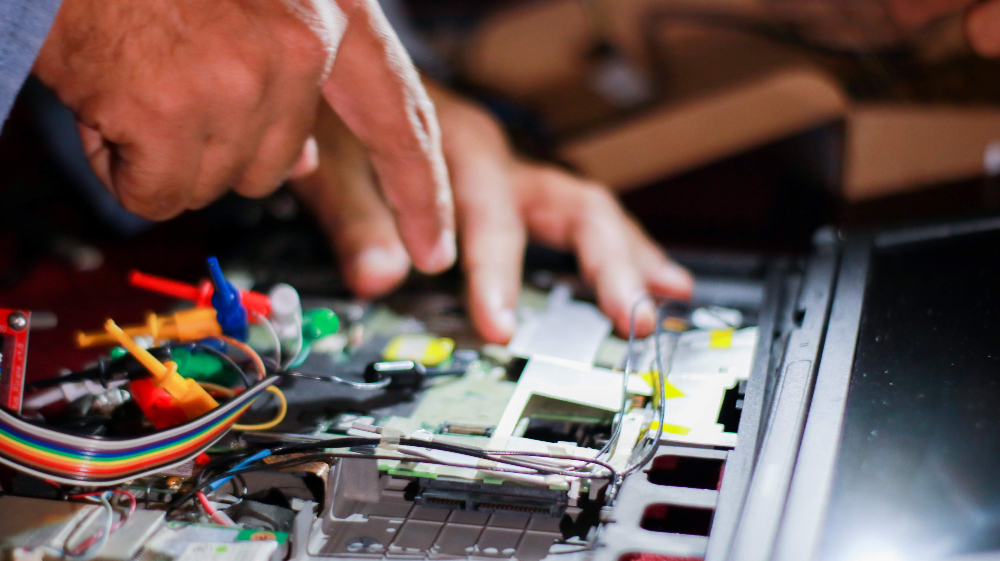

**Debutsav** commenced on the 14th of September 2019 at 9 am at the ETC seminar hall. The event was organized by **GEC FOSS Community**

The first talk was given by *Amaldev Manuel*, an IIT professor, on TeX and typography. He gave a brief description and history of Latex and also a brief demonstration of using LaTeX. The next talk was on a CSS framework created by a student of GEC, *Salil Naik* (Student of Computer Science). He introduced us to his venture PRODUCT.css. It's a grid system whose file size is 9kb.
This was followed by a talk given on FOSSology by *Shahemm Azmal M MD and Gaurav Mishra*. He introduced us to a free software FOSSology which checks the program for licensing and credits given to people for the same. He also highlighted the importance of licensing.

 
The next session was on the privacy on social networking sites. He discussed the famous privacy threats and also told us different alternatives for the same to help us keep our identity and information safe.

Following lunch was a session by *Varun Priolkar*. The session introduced us to the fundamentals of how DevOps(the art of managing infrastructure at scale) works. He also told us about the importance of automation in daily life.

The next session was held on the topic of tracking internet shutdowns in India by *Raju Devidas*. He introduced us to his organization as well as OONI a global organization who tracks down global internet shutdowns. We had a brief discussion regarding the reasons for the shutdowns.

The last program for the day was a presentation by *students of IIT Goa and GEC* on their project called QGIS.QGIS model helps in water crisis management and solves problems of land depletion.

 

**Debutsav day 2** began with a talk by alt news founder Pratik who told us about free software and speech. He discussed current issues and the importance of a fact-checking website in today's money-making, business-oriented world.
The second talk for the day was on coreboot for which the speaker was *Kiran*. Coreboot is a substitute to BIOS or UEFI which are the proprietary firmware in most PC's. This is a safer, free option. This was followed by a live demo of the same by Abhas Abhinav. He showed us many other interesting demonstrations regarding the same which was pretty interesting and gave us some useful tips for our computers in the future.

The next session was conducted by *Dr Neha Karanjikar* on SimPy which performs discrete event simulations. Its a python package which enables u to consider time delay while running your program.

 
Following the lunch break was a session by our very own student of TE Comp GEC *Vritika Naik*. She introduced us to the world of animation and demonstrated to us Blender. Blender is a software which helps to create animations easily and has a good visual appeal.
Further, we had a DevOps engineer, Minto Joseph, deliver a talk on Linux tracing. He provided some tools for troubling shooting issues from kernel to the application layer. 

The last session was by *Akhil Varkey*. F-Droid was introduced to the audience. It is a free and secure app store used to download apps that are open source and much more secure than most apps from the google play store.

 
Debutsav was very useful in increasing our technical knowledge. It was a  well organized event and we hope to see many more of such in the college.